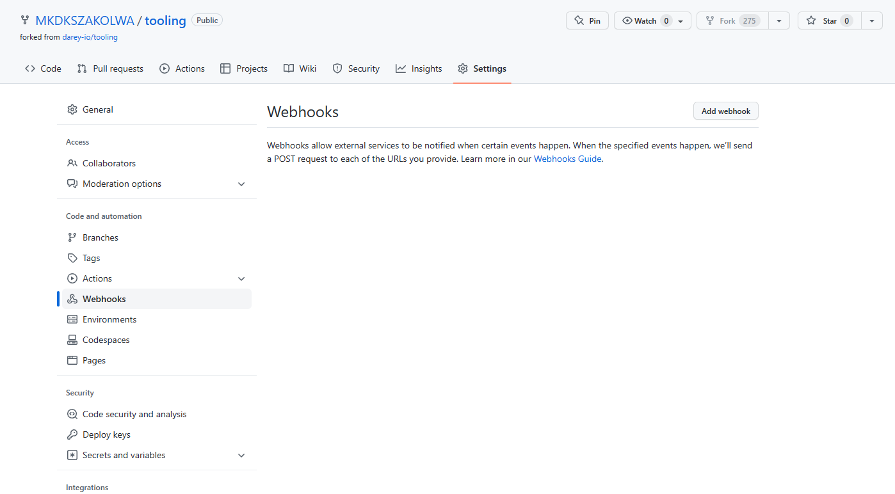
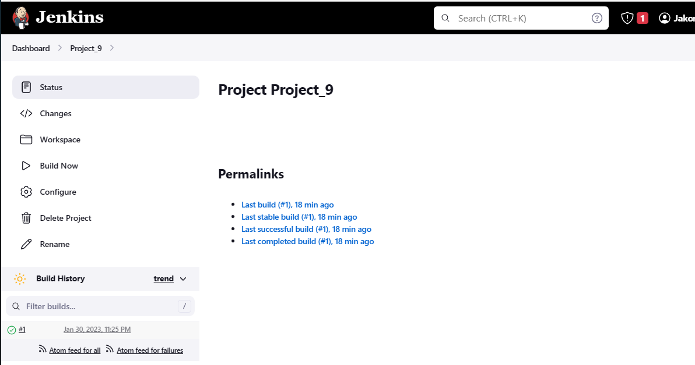
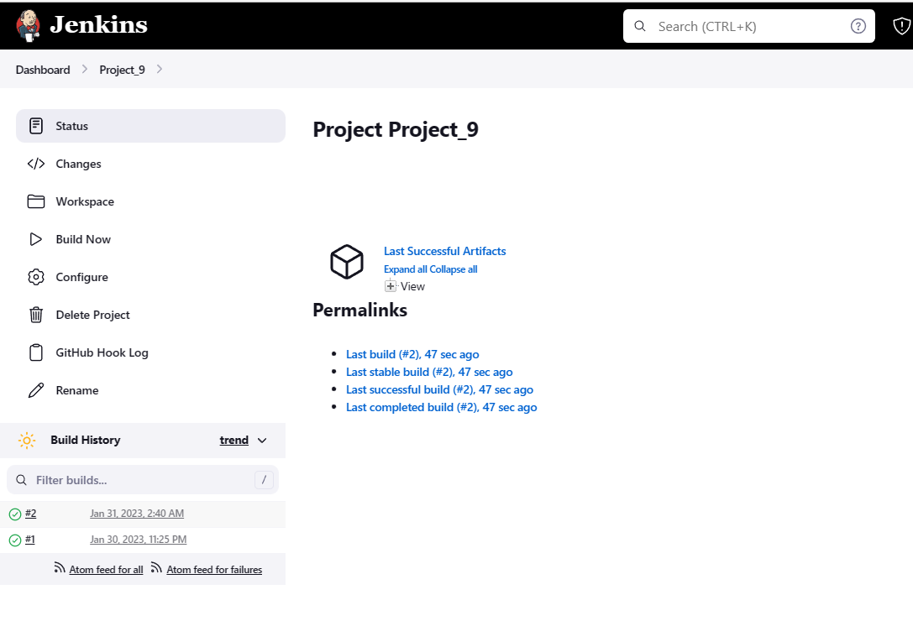
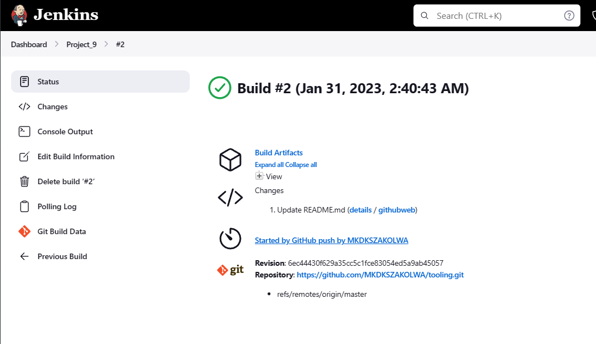

# (STEP 19) PROJECT 9: CONTINOUS INTEGRATION PIPELINE FOR TOOLING WEBSITE

## TOOLING WEBSITE DEPLOYMENT AUTOMATION WITH CONTINUOUS INTEGRATION. INTRODUCTION TO JENKINS


In previous Project 8 we introduced *horizontal scalability* concept, which allow us to add new Web Servers to our Tooling Website and you have successfully deployed a set up with 2 Web Servers and also a Load Balancer to distribute traffic between them. If it is just two or three servers – it is not a big deal to configure them manually. Imagine that you would need to repeat the same task over and over again adding dozens or even hundreds of servers.

DevOps is about Agility, and speedy release of software and web solutions. One of the ways to guarantee fast and repeatable deployments is *Automation* of routine tasks.

In this project we are going to start automating part of our routine tasks with a free and open source automation server – *Jenkins.* It is one of the mostl popular *CI/CD* tools, it was created by a former Sun Microsystems developer Kohsuke Kawaguchi and the project originally had a named "Hudson".

Acording to Circle CI, Continuous integration (CI) is a software development strategy that increases the speed of development while ensuring the quality of the code that teams deploy. Developers continually commit code in small increments (at least daily, or even several times a day), which is then automatically built and tested before it is merged with the shared repository.

In our project we are going to utilize Jenkins CI capabilities to make sure that every change made to the source code in GitHub `https://github.com/<yourname>/tooling` will be automatically be updated to the Tooling Website.


Task
Enhance the architecture prepared in Project 8 by adding a Jenkins server, configure a job to automatically deploy source codes changes from Git to NFS server.

Here is how your updated architecture will look like upon competion of this project:


## INSTALL AND CONFIGURE JENKINS SERVER

### Step 1 – Install Jenkins server

1. Create an AWS EC2 server based on Ubuntu Server 20.04 LTS and name it "Jenkins"

    - Create a new security group with port 8080 and port 22 opened as shown below.

    Port 8080

        Type - Custom TCP Rule

        Protocal - TCP

        Port range - 8080

        Source - 0.0.0.0/ 

        Description Connect to Jenkins

    Port 22

        Type - Custom TCP Rule
        Protocal - TCP
        Port range - 8080
        Source - 0.0.0.0/ 
        Description Connect to Jenkins


    


    Once the EC2 is running, connect throgh the terminal through SSH.

    


2. Install JDK (since Jenkins is a Java-based application)

   `sudo apt update`

   

    `sudo apt install default-jdk-headless`

    click y when prompted.

    

3. Install Jenkins

   ```
   wget -q -O - https://pkg.jenkins.io/debian-stable/jenkins.io.key | sudo apt-key add -
   sudo sh -c 'echo deb https://pkg.jenkins.io/debian-stable binary/ > \
       /etc/apt/sources.list.d/jenkins.list'
   sudo apt update
   sudo apt-get install jenkins
   ```

   Click y when prompted.

   


   Make sure Jenkins is up and running

   `sudo systemctl status jenkins`

   


4. By default Jenkins server uses TCP port 8080 – open it by creating a new Inbound Rule in your EC2 Security Group. In our case you dont need to because it the Security group that was created called "Jenkins" this was already opened. This is shown below.

   


5. Perform initial Jenkins setup.
From your browser access `http://<Jenkins-Server-Public-IP-Address-or-Public-DNS-Name>:8080`

   You will be prompted to provide a default admin password

   You can get the Public IP for Jenkins server from the AWS Instances console. The updated link is shown below. Paste it on the browser.

   http://3.136.23.195:8080

   The screen below will be displayed.

   


   You can get the password from the path below.

   /var/lib/jenkins/secrets/initialAdminPassword

   Run the command below and the password will be generated.

   `sudo cat /var/lib/jenkins/secrets/initialAdminPassword`

   

   Copy the password and paste it in the browser for "Unlock Jenkins" then continue.

   The screen below will be displayed. You will be asked which plugings to install – choose and click suggested plugins.

   


   While installation is in  progress, the screen below will be displayed.

   


   Once plugins installation is done . The screen below will be displayed. Create an admin user and you will get your Jenkins server address. use the credentials below.


   Username : Project9_Admin

   Password: Password

   Full Name: Jakomala Jakowidi

   Email: kolwa.mixxxxxxxxxxx

   Save and continue.

   The screen below will be displayed. Do not save password. Click Save and Finish.

   The screen below will be displayed showing that Jenkins is ready.

   

   Click Start using Jenkins. Jenkins Dashboard will be displayed as shown below.

   


### Step 2 – Configure Jenkins to retrieve source codes from GitHub using Webhooks

In this part, you will learn how to configure a simple Jenkins job/project (these two terms can be used interchangeably). This job will will be triggered by GitHub webhooks and will execute a ‘build’ task to retrieve codes from GitHub and store it locally on Jenkins server.

1. Enable webhooks in your GitHub repository settings.

   Login to your Github account.

   


   On the top left corner seach box , search for MKDKSZAKOLWA/ tooling. The screen below will be displayed. This is the tooling repo whoch you forked in project 7 from Darey.

   


   Note:

   To fork a repo, login to your Github account and and search for the repo that you want to fork. Once it comes up then on the top right, click fork and then complete. it will be transferred to your Github account.


    Click on Settings and then Webhooks.

    

    Add Webhook

    


    You will be prompted to Confirm Access.


    

    Login.

    The screen below will be displayed.

    


    Copy the Jenkins link and paste it under "Payload URL" in Github. Ensure you add github-webhook/ as shown below.

    `http://3.145.62.212:8080/github-webhook/`

    Under Content Type, select application/json

    Leave everything as defaulted with Just the push event and Active selected.

    

    Click Add Webhook.


    The screen below will be displayed.

    


2. Go to Jenkins web console, click "New Item" and create a "Freestyle project"


    


    Enter Project_9 under Item Name. Select Freestyle Project and then  Ok.

    

    The screen below will be displayed.

    

    Under Source Code Management select Git.

    

    To connect your GitHub repository, you will need to provide its URL, you can copy from the repository itself.

    Go to your Account/tooling in Github and then under code , copy the https url as shown below.

    

    The url is ;

    `https://github.com/MKDKSZAKOLWA/tooling.git`

    Copy it under Repository URL.

    

    Click Add under Credentials, then click on Jenkins.

    


    The screen below will be displayed.

    

    Get your Github credentials (Username and Password) and input in the below page, then click Add.

    


    Click Save.

    


    

    Let us try to run the build. For now we can only do it manually.Click "Build Now" button, if you have configured everything correctly, the build will be successfull and you will see it under #1


    

    You can open the build by clicking on #1 and check in "Console Output" if it has run successfully.

    


    
    
    
    We just made our very first Jenkins build!

    But this build does not produce anything and it runs only when we trigger it manually. Let us fix it.


3. Click "Configure" your job/project and add these two configurations. To get to Configuire, click Project_9 and you will then see Configure.

   


     Configure triggering the job from GitHub webhook:

     Under Build Triggers select Github hook trigger for GITscm polling.

     


     Configure "Post-build Actions" to archive all the files – files resulted from a build are called "artifacts".

     

     Put ** under Files to Archive and then save.

     

     The below screen will be displayed.

     


     Now, go ahead and make some change in any file in your GitHub repository (e.g. README.MD file) and push the changes to the master branch.

    

     Go to your Tooling repo in Guthub.

     


     Click the READ.ME.md file to edit.

     


     The screen below will be displayed.

     


     At the top right click Edit this file.


     

     The screen below will be displayed.


     


     At the bottom of the file add the statement "Checking Jenkins" . This can be anything .

     Then click "Commit Changes".

     


     You will see that a new build has been launched automatically (by webhook) and you can see its results – artifacts, saved on Jenkins server.


     


     Click on Build #2

     


     Click on Console Output. It will show that it finished successfully.

     


     Click on Status > HTML > img


     
     


     You have now configured an automated Jenkins job that receives files from GitHub by webhook trigger (this method is considered as ‘push’ because the changes are being ‘pushed’ and files transfer is initiated by GitHub). There are also other methods: trigger one job (downstreadm) from another (upstream), poll GitHub periodically and others.

     By default, the artifacts are stored on Jenkins server locally.


    
    `ls /var/lib/jenkins/jobs/tooling_github/builds/<build_number>/archive/`

    To do this;
    `cd /var/lib`
    `cd jenkins`
    `cd jobs`
    `cd Project_9`
    `cd builds`
    `cd 2`
    `cd archive`
    `ll`

    
    
## CONFIGURE JENKINS TO COPY FILES TO NFS SERVER VIA SSH

### Step 3 – Configure Jenkins to copy files to NFS server via SSH

Now we have our artifacts saved locally on Jenkins server, the next step is to copy them to our NFS server to */mnt/apps* directory.

Jenkins is a highly extendable application and there are 1400+ plugins available. We will need a plugin that is called "Publish Over SSH".

Install "Publish Over SSH" plugin.
On main dashboard select "Manage Jenkins" and choose "Manage Plugins" menu item.


On "Available" tab search for "Publish Over SSH" plugin and install it. Select it and click on Install without restart.


The screen below will be displayed once the installtion is successful.


2. Configure the job/project to copy artifacts over to NFS server.
On main dashboard select "Manage Jenkins" and choose "Configure System" menu item.


   Scroll down to Publish over SSH plugin configuration section and configure it to be able to connect to your NFS server:

   

*Note*

 The NFS Server that I initially used was of a higher version (RHEL-9) which did not work with the below configuration. We need to use a lower version of Redhat (RHEL -8). Follow the steps below to spin another EC2 server (Redhat (RHEL-8.6). Again we are only doing this because the NFS server that we created in Project 7 did not work for Project 9 due to a higher version.

 - In the AWS console, click Lauch Instances at the top right corner.
 - Click Browse more AMIs
 - Click AWS Marketplace AMIs(7033) 
 - Select Redhat Enterprise Linux 8
 - Click Continue and launch the server as you would always do.
 - We will use use existing security and select Launch Wizard 15 as that is the secuirity that we used for the NFS server in Project 7

 - Once you have spinned the server, login to it through the terminal and run the command below to create /mnt/apps directory.

     `sudo mkdir /mnt/apps`

     


   A). Provide a private key (content of .pem file that you use to connect to NFS server via SSH/Putty). In our case we used the *All Projects* one that we have been using to connect.

   B). Arbitrary name

   C). Hostname – can be private IP address of your NFS server

   D). Username – ec2-user (since NFS server is based on EC2 with RHEL 8)

   E). Remote directory – /mnt/apps since our Web Servers use it as a mointing point to retrieve files from the NFS server.

   Input the below information.


   Copy the Private key under Key.

   Click add under SSH servers.

   Name : Project 9 NFS Server

   

   Host Name (The Private IP address of the Project 9 NFS Server):172.31.40.210

   Username:ec2-user

   Remote Directory : /mnt/apps

   Click Test Configuration at the bottom right. If successful it show show Success. Remember, that TCP port 22 on NFS server must be open to receive SSH connections.

   


   Click Apply and then Save.


   


   The screen below will be displayed.

   


   Open your Jenkins job/project configuration page and add another one "Post-build Action"

    - When in the Jenkins Dashboard, click on Project 9.

      

    - Click on Configure.

      


    - Click on Post Build Actions, scroll to the bottom of the page and add Post Build Actions.


      


      


      Put;

      Files to Archive : **

      SSH Server : Project 9 SSH Server

      Source File : **

      It should look like the screen below. Apply then Save.


      


      Go back to your Github account and search for Tooling.


      


      The Tooling that your forked before will be displayed.


      


      Click on the README.md file.


      


      Click on Edit at the top right.


      


      The screen below will be displayed.


      


      Make any changes you want in the file by scrolling at the bottom of the file and adding the change . In our case I will add "I have enjoyed working on Project 9".


      


      Click on "Commit Changes".


      


      Go back to Jenkins Dashboard and you should be able to see the change you made at the bottom left. In our case it is #4.

      


      Click on # 4.

      Click on Console Output.

      

      The screen below will be displayed. It will show that there is an error. 


      


      The error shown at the bottom is;

      *ERROR: Exception when publishing, exception message [Permission denied]*


      To correct this follow the steps below by changing ownership and permissions on mnt;

        - Login to Project 9 NFS Server throgh the terminal if you are disconnected.

        - Run the command; `sudo chown -R nobody:nobody /mnt`
        - Run the command; `sudo chmod -R 777 /mnt`

          


      Go  back on Jenkins and click on Project 9 at the top.


      


      Click on Build Now.


      

      Build #6 will be displayed with a green tick mark.


      


      Click on #6. 


      


      Click on Console Output.


      


      The screen below will be displayed and it will show at the bottom that it finished successfully.


      


      To make sure that the files in */mnt/apps* have been udated – connect via SSH/Putty to your Project 9 NFS server and check *README.md* file

      `cat /mnt/apps/README.md`

      

      If you see the changes you had previously made in your GitHub – the job works as expected. It our case it shows the changes we added at the bottom as *"I have enjoyed working on Project 9"*.


      


      Project Completed.


    


